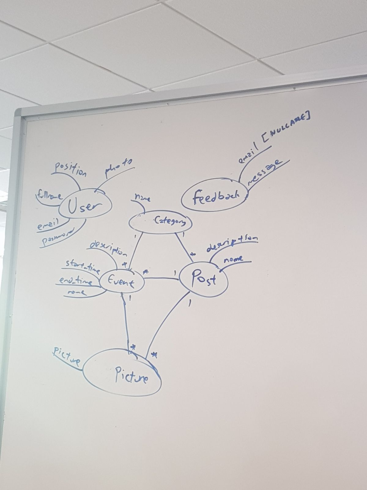

# panutanq
PINUS Website

## Schema Diagram

## Description
Website ini ditujukan untuk orang-orang di luar NUS, seperti organisasi-organisasi luar, mahasiswa luar, dst. Anggapannya seperti corporate website saja.

Oleh karena itu, isi utama website ini adalah portfolio event-event yang dilakukan di PINUS, i.e. NUANSA, MKP, dst.
Hal-hal ini disebut "event". Untuk setiap event, akan ada deskripsi eventnya yang dapat diupdate admin. Event page juga bisa diintegrasi dengan page FB event tersebut sehingga menampilkan feed dari page tersebut.

Fungsi users di aplikasi ini hanyalah sebagai admin, untuk update konten-konten yang ada di website ini. Setiap member exco akan memiliki user khusus dengan privilege yang berbeda-beda.

Selain itu, website ini juga akan memiliki hal-hal lainnya seperti:
* Static pages
  * Freshman guide (general and per faculty)
  * Current exco
  * How to reach NUS (mungkin bisa diletakkan di page contact us juga)
* Contact form untuk mengirimkan feedback ke PINUS EXCO
  * Bisa mensupport anonymous feedback
* Integrate with various widgets (FB)
* Blog MANUSIA (migrated from wordpress)
* Internal for PINUS-ians (authentication dengan FB OAuth [Issue #6](https://github.com/pinus-it/panutanq/issues/6)
  * PINUS Database untuk database senior" [Issue #7](https://github.com/pinus-it/panutanq/issues/7)
  * PINUS Career listing
